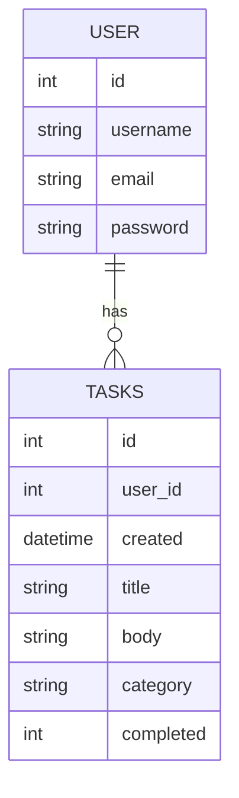

<<<<<<< HEAD
# Todo App 

This is a simple Todo application built with Flask, sqlite.

```bash
python main.py
```
- And  visit http://127.0.0.1:5000

You may try the project here if i have started the server: https://todo-ib8u.onrender.com
 
## Project Structure

The project has the following structure: (Used tree)
```markdown
.
├── dir.txt
├── flaskr
│   ├── auth.py
│   ├── db.py
│   ├── __init__.py
│   ├── __pycache__
│   │   ├── auth.cpython-310.pyc
│   │   ├── db.cpython-310.pyc
│   │   ├── __init__.cpython-310.pyc
│   │   └── tasks.cpython-310.pyc
│   ├── schema.sql
│   ├── static
│   │   ├── edit.png
│   │   ├── Gemini_Generated_Image.jpeg
│   │   ├── left-image.jpeg
│   │   ├── menu.png
│   │   └── style.css
│   ├── tasks.py
│   └── templates
│       ├── auth
│       │   ├── login.html
│       │   └── register.html
│       ├── base.html
│       └── task
│           ├── create.html
│           ├── index.html
│           └── update.html
├── instance
│   ├── config.py
│   └── flaskr.sqlite
├── pyproject.toml
└── README.MD

7 directories, 25 files
```
## Description

- This is a simple todo app with following features:

1) User authentication
    - There are options for register, login, logout
    - This uses user table in the database
    - Passwords are handled securely using the `werkzeug.security` module.
    - When a user registers, their password is hashed using the `generate_password_hash` function before it is stored in the database.
    - The `generate_password_hash` function takes the plain text password as an argument and returns a string that includes the hashing algorithm that was used, the salt, and the actual hashed password.
    - When a user logs in, the `check_password_hash` function is used to verify the user's password.
    - The `check_password_hash` function takes two arguments: the hashed password that was stored in the database, and the plain text password that the user entered. It returns `True` if the password matches the hash, and `False` otherwise.
    - This way of handling passwords is secure because even if someone gains access to the database, they won't be able to see the actual passwords, only their hashes. And because the hashing function is one-way, they can't reverse-engineer the original password from the hash.

2) Task management
    - Users can create, read, update and delete tasks after loggin in.

## Tools used:
    - Flask: Python framework for frontend
    - Sqlite: For database management
    - Plain HTML, CSS for UI.

## Database schema:

